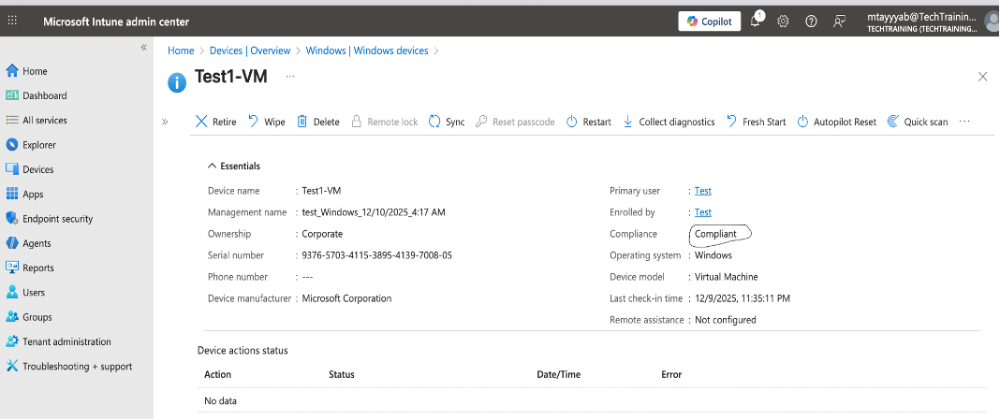
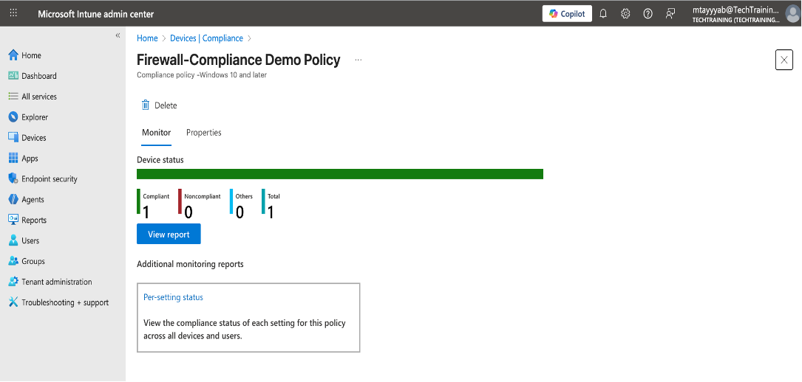
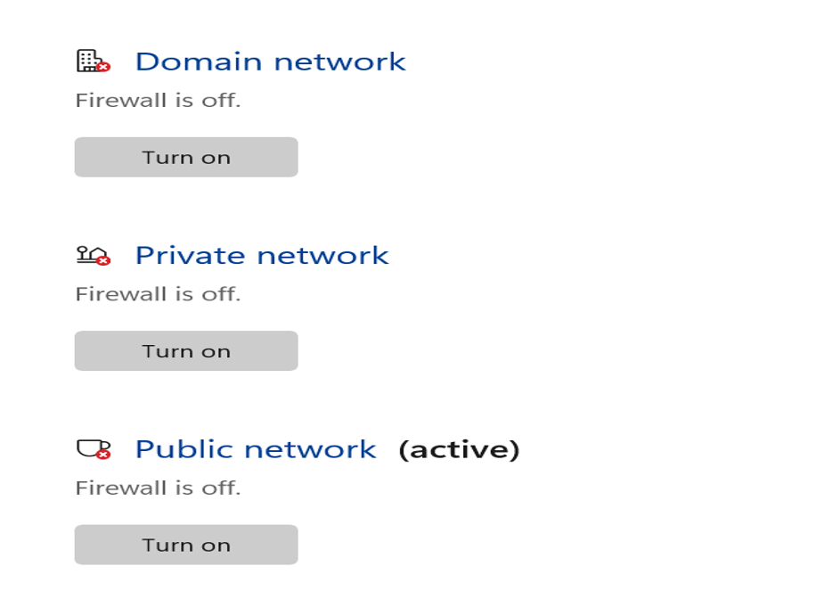
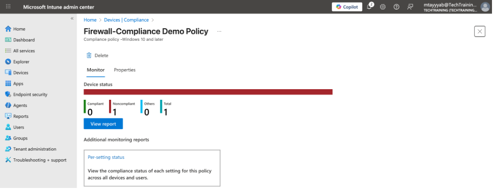
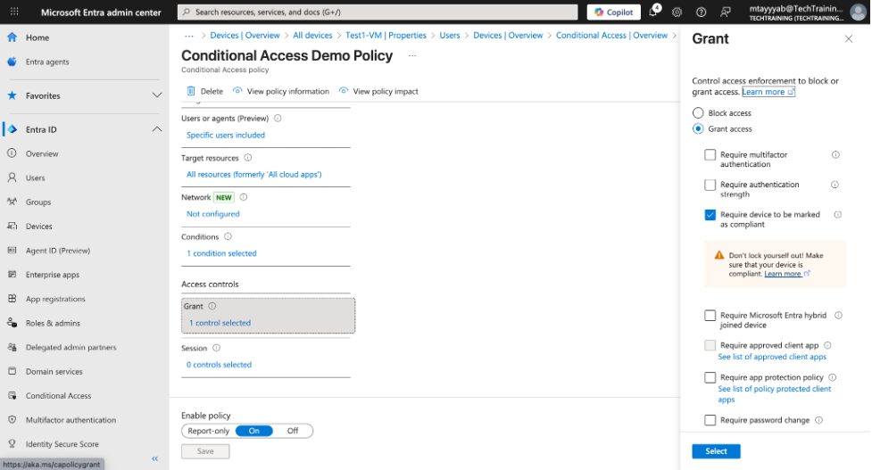
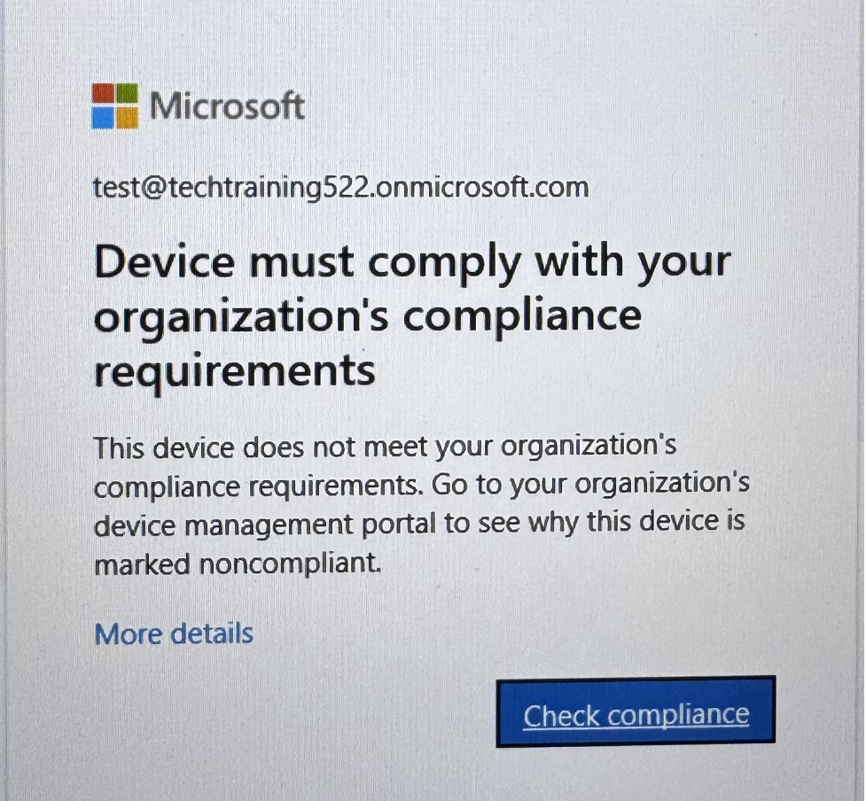
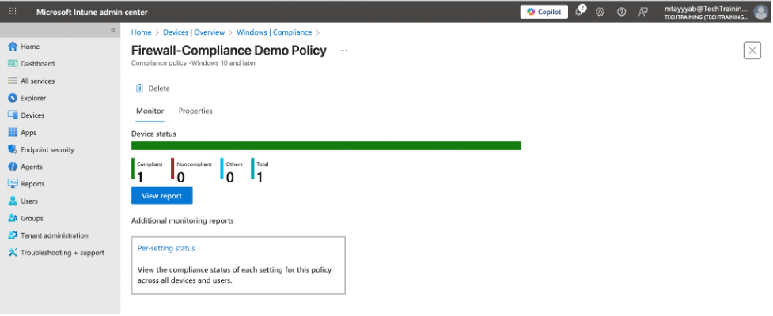

# Intune Firewall Compliance Enforcement Demo

## 📌 Overview

This project demonstrates how Microsoft Intune and Conditional Access work together to enforce a Zero Trust security model using Windows Defender Firewall as a compliance signal. A Windows 11 device was enrolled into Intune, evaluated against a firewall-based compliance policy, intentionally placed into a non-compliant state, blocked from accessing Microsoft 365 by Conditional Access, and then remediated to restore compliance and access.

The walkthrough shows the full lifecycle:

**Healthy device → Policy applied → Violation → Non-compliant → Access blocked → Remediation → Access restored**

---
## Skills Demonstrated

- Microsoft Entra ID user and role management
- Conditional Access policy design and enforcement
- Group-based MFA targeting using security groups
- Break-glass (emergency access) account configuration
- Privileged Identity Management (PIM) role assignments
- MFA validation using Microsoft Entra sign-in logs
- Identity security posture review and lockout prevention

---

## 🛠 Tools & Environment

- **Microsoft 365 tenant** with Intune (Endpoint Manager) and Entra ID  
- **Windows 11 VM** (Test1-VM), Entra ID joined  
- **Entra ID test user** (`test@TechTraining522.onmicrosoft.com`)  
- **Intune MDM enrollment**  
- **Microsoft 365 apps** (Office.com, Outlook, Teams)  
- **Conditional Access** in Entra ID  

---

## 📂 Repository Structure

- **README.md**
- **screenshots/**
  - step01-device-enrollment.png  
  - step02-compliance-policy.png  
  - step03-baseline-compliant.png  
  - step04-firewall-disabled.png  
  - step05-device-sync.png  
  - step06-ca-policy.png  
  - step07-ca-block.png  
  - step08-compliant-access-restored.png  

---

## ✅ Step 1 — Device Enrollment Verification

The Windows 11 VM (**Test1-VM**) was joined to Entra ID and signed in using the test account (`test@TechTraining522.onmicrosoft.com`).  
In **Settings → Accounts → Access work or school**, the device was confirmed to be connected to the organization and managed by **Intune (MDM)**.

This ensures Intune can apply compliance policies and report device health.

**Screenshot:**  

---

## ✅ Step 2 — Compliance Policy Configuration

A Windows compliance policy was created in Intune requiring **Microsoft Defender Firewall** to be enabled for all network profiles.

This establishes the baseline security requirement Intune will evaluate.

**Screenshot:**  

---

## ✅ Step 3 — Baseline Compliance Validation

After assignment to all devices/users, the VM was synced and evaluated as **Compliant** while the firewall was still enabled.

This confirms the policy is applied and functioning before testing violations.

**Screenshot:**  

---

## ✅ Step 4 — Simulating a Compliance Violation

Windows Defender Firewall (Domain, Private, Public profiles) was manually **disabled** on the VM using administrative credentials.

This deliberate misconfiguration violates the Intune firewall requirement.

**Screenshot:**  

---

## ✅ Step 5 — Device Sync to Trigger Compliance Evaluation

A manual sync was triggered from:

- **Intune portal:** Devices → Test1-VM → Sync  
- **Windows VM:** Settings → Accounts → Access work or school → Info → Sync  

Intune re-evaluated and detected the firewall violation.

**Screenshot:**  

---

## ✅ Step 6 — Conditional Access Policy Overview

A Conditional Access policy was created to block access to Microsoft 365 unless the device is marked **Compliant**.

**Assignments:**  
- Users: Test user  
- Cloud apps: Microsoft 365 / Office 365  

**Grant Controls:**  
- **Require device to be marked as compliant**

This ties Intune compliance to Microsoft 365 access — core Zero Trust behavior.

**Screenshot:**  

---

## ✅ Step 7 — Testing Access Restriction on a Non-Compliant Device

While signed into the now **non-compliant** VM using the test Entra user, attempts to access:

- Office.com  
- Outlook (OWA)  
- Microsoft Teams  

were **blocked**.

The Conditional Access policy enforced the requirement and denied access due to non-compliance.

**Screenshot:**  

---

## ✅ Step 8 — Remediating the Device and Restoring Compliance (Final Step)

Firewall profiles were re-enabled on the Windows VM, and another sync was performed.

Intune reevaluated the device and marked it **Compliant** again.

Access to Microsoft 365 services was restored automatically — demonstrating full Zero Trust workflow:

**Misconfiguration → Detection → Access blocked → Fix applied → Compliance restored → Access restored**

**Screenshots:**  

---

## 🧩 Key Learnings

- Intune continuously monitors and evaluates device compliance  
- Conditional Access uses compliance to control access to Microsoft 365  
- Device misconfigurations immediately impact access in Zero Trust environments  
- Fixing the root issue and syncing restores compliance and functionality  
- This lab demonstrates real-world enterprise enforcement patterns  

---

